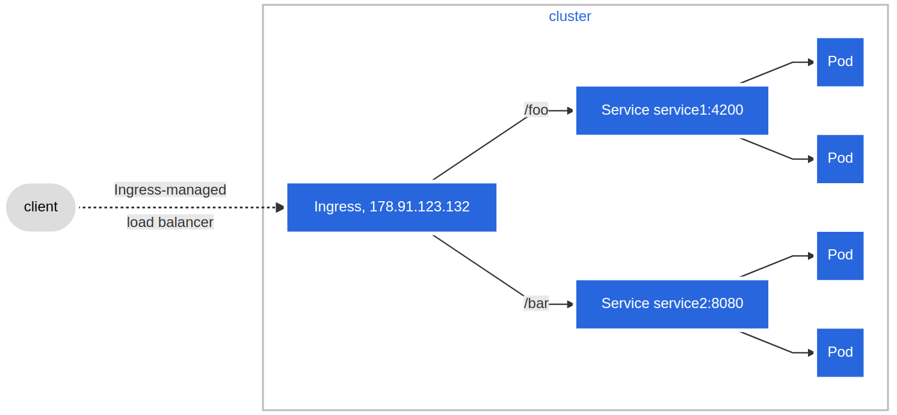

This lab cannot verified due to the lack of "ingress".

```sh
minikube addons enable ingress

# # run command below if the addon failed to work
# minikube kubectl -- delete all --all -n ingress-nginx

# kubectl create -f name-based.yaml

minikube service <service-name>

kubectl get ingress <ingress-name>
kubectl describe ingress <ingress-name>

# update host configuration file for service IP
bash -c 'echo "$(minikube ip) blue.example.com green.example.com" >> /etc/hosts'
```

```sh
export HTTP_PROXY=http://116.163.10.251:16335
export HTTPS_PROXY=https://116.163.10.251:16335
export NO_PROXY=localhost,127.0.0.1,10.96.0.0/12,192.168.59.0/24,192.168.39.0/24
```

## Reference

- Virtual Host:
  
- Fanout:
  
- Proxies and VPNs: https://minikube.sigs.k8s.io/docs/handbook/vpn_and_proxy/
